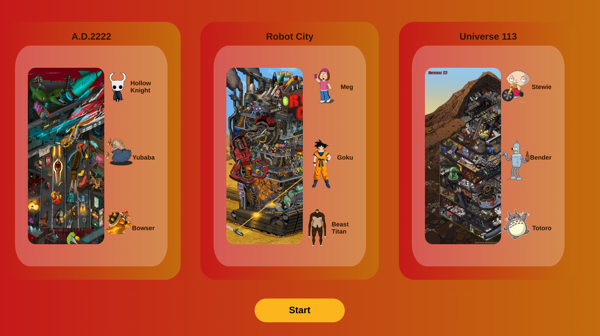
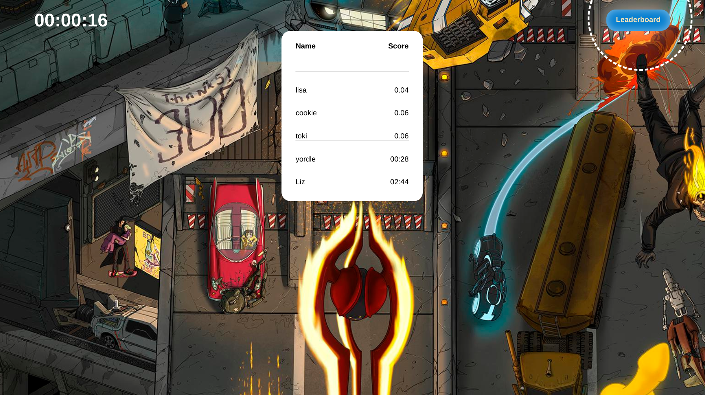
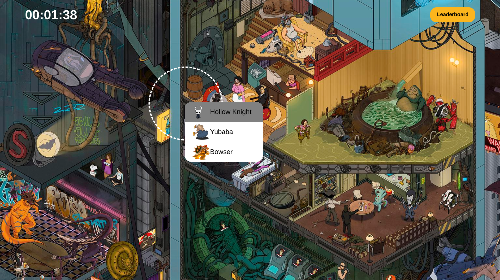

This is a Where's Waldo game created following The Odin Project guidelines. 
The game was created using Firebase, React, JavaScript & CSS, and tested using the React Testing Library. 
 
Live site URL: https://itsaflamingo.github.io/wheres-waldo/

Assignment: https://www.theodinproject.com/lessons/node-path-javascript-where-s-waldo-a-photo-tagging-app

